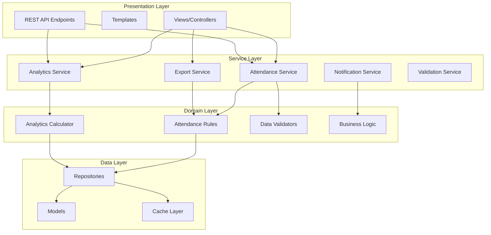

# Design Document

## Overview

This design document outlines the architectural improvements for the attendance management system, transforming it from a traditional Django application into a more functional, maintainable, and robust system. The design emphasizes pure functions, immutable data structures, clear separation of concerns, and comprehensive validation while maintaining Django's strengths.

The improved system will feature a layered architecture with distinct service layers, enhanced analytics capabilities, bulk operations, and better data integrity through functional programming principles.

## Architecture

### High-Level Architecture



### Functional Programming Principles

The system will be redesigned around these core functional programming concepts:

1. **Pure Functions**: All business logic functions will be pure, taking inputs and returning outputs without side effects
2. **Immutable Data**: Use immutable data structures for calculations and transformations
3. **Function Composition**: Build complex operations by composing smaller, testable functions
4. **Separation of Effects**: Isolate side effects (database operations, notifications) from pure business logic

## Components and Interfaces

### 1. Attendance Service Layer

**Purpose**: Handles all attendance-related operations with pure functional approach

**Key Components**:
- `AttendanceService`: Main service orchestrating attendance operations
- `AttendanceValidator`: Pure functions for validating attendance data
- `AttendanceCalculator`: Pure functions for attendance computations

**Interface**:
```python
from typing import NamedTuple, List, Optional, Union
from datetime import date
from dataclasses import dataclass
from enum import Enum

class AttendanceStatus(Enum):
    PRESENT = "present"
    ABSENT = "absent"
    SCHOOL_OFF = "school_off"

@dataclass(frozen=True)
class AttendanceRecord:
    user_id: int
    date: date
    status: AttendanceStatus
    created_at: datetime
    updated_at: Optional[datetime] = None

class ValidationResult(NamedTuple):
    is_valid: bool
    errors: List[str]
    sanitized_data: Optional[dict] = None

class AttendanceService:
    @staticmethod
    def validate_attendance_data(data: dict) -> ValidationResult:
        """Pure function to validate attendance input"""
        pass
    
    @staticmethod
    def mark_attendance(user_id: int, date: date, status: AttendanceStatus) -> Union[AttendanceRecord, ValidationResult]:
        """Mark attendance with validation"""
        pass
    
    @staticmethod
    def bulk_mark_attendance(records: List[dict]) -> List[Union[AttendanceRecord, ValidationResult]]:
        """Bulk attendance marking with validation"""
        pass
```

### 2. Analytics Engine

**Purpose**: Provides comprehensive attendance analytics using pure functional calculations

**Key Components**:
- `AttendanceAnalytics`: Main analytics calculator
- `TrendAnalyzer`: Calculates attendance trends and patterns
- `ProjectionCalculator`: Predicts future attendance requirements

**Interface**:
```python
@dataclass(frozen=True)
class AttendanceStats:
    total_days: int
    present_days: int
    absent_days: int
    school_off_days: int
    attendance_percentage: float
    current_streak: int
    longest_streak: int

@dataclass(frozen=True)
class AttendanceTrend:
    period: str  # 'weekly', 'monthly'
    data_points: List[float]
    trend_direction: str  # 'improving', 'declining', 'stable'

class AttendanceAnalytics:
    @staticmethod
    def calculate_stats(records: List[AttendanceRecord]) -> AttendanceStats:
        """Pure function to calculate attendance statistics"""
        pass
    
    @staticmethod
    def analyze_trends(records: List[AttendanceRecord], period: str) -> AttendanceTrend:
        """Pure function to analyze attendance trends"""
        pass
    
    @staticmethod
    def project_requirements(current_stats: AttendanceStats, target_percentage: float, remaining_days: int) -> int:
        """Pure function to calculate required present days to meet target"""
        pass
```

### 3. Validation Service

**Purpose**: Provides comprehensive data validation using pure functions

**Key Components**:
- `DateValidator`: Validates date-related constraints
- `BusinessRuleValidator`: Validates business logic constraints
- `DataSanitizer`: Sanitizes and normalizes input data

**Interface**:
```python
class ValidationService:
    @staticmethod
    def validate_date(date_input: str) -> ValidationResult:
        """Pure function to validate date input"""
        pass
    
    @staticmethod
    def validate_future_date(target_date: date) -> ValidationResult:
        """Pure function to check if date is not in future"""
        pass
    
    @staticmethod
    def validate_business_rules(attendance_data: dict) -> ValidationResult:
        """Pure function to validate business constraints"""
        pass
    
    @staticmethod
    def sanitize_input(raw_data: dict) -> dict:
        """Pure function to sanitize and normalize input"""
        pass
```

### 4. Export Service

**Purpose**: Handles data export in multiple formats using functional composition

**Key Components**:
- `DataFormatter`: Pure functions for data transformation
- `ReportGenerator`: Composes formatters to generate reports
- `ExportProcessor`: Handles file generation and compression

**Interface**:
```python
@dataclass(frozen=True)
class ExportConfig:
    format: str  # 'csv', 'pdf', 'json'
    include_charts: bool
    date_range: Optional[tuple] = None

class ExportService:
    @staticmethod
    def format_data_for_csv(records: List[AttendanceRecord]) -> List[dict]:
        """Pure function to format data for CSV export"""
        pass
    
    @staticmethod
    def generate_pdf_report(stats: AttendanceStats, records: List[AttendanceRecord]) -> bytes:
        """Generate PDF report with charts"""
        pass
    
    @staticmethod
    def create_backup_data(records: List[AttendanceRecord], metadata: dict) -> dict:
        """Pure function to create backup data structure"""
        pass
```

### 5. Notification Service

**Purpose**: Intelligent notification system with adaptive behavior

**Key Components**:
- `NotificationRuleEngine`: Determines when to send notifications
- `MessageComposer`: Creates notification content
- `DeliveryScheduler`: Manages notification timing

**Interface**:
```python
@dataclass(frozen=True)
class NotificationRule:
    condition: str
    message_template: str
    priority: int
    frequency_limit: int

class NotificationService:
    @staticmethod
    def should_send_notification(stats: AttendanceStats, rules: List[NotificationRule]) -> List[NotificationRule]:
        """Pure function to determine which notifications to send"""
        pass
    
    @staticmethod
    def compose_message(rule: NotificationRule, stats: AttendanceStats) -> str:
        """Pure function to create notification message"""
        pass
```

## Data Models

### Enhanced Attendance Model

```python
from django.db import models
from django.contrib.auth.models import User
from django.core.validators import MinValueValidator, MaxValueValidator

class AttendanceRecord(models.Model):
    user = models.ForeignKey(User, on_delete=models.CASCADE, db_index=True)
    date = models.DateField(db_index=True)
    status = models.CharField(
        max_length=20,
        choices=[
            ('present', 'Present'),
            ('absent', 'Absent'),
            ('school_off', 'School Off'),
        ]
    )
    created_at = models.DateTimeField(auto_now_add=True)
    updated_at = models.DateTimeField(auto_now=True)
    
    class Meta:
        unique_together = ('user', 'date')
        indexes = [
            models.Index(fields=['user', 'date']),
            models.Index(fields=['user', 'status']),
        ]

class AttendanceCache(models.Model):
    """Cache for expensive calculations"""
    user = models.ForeignKey(User, on_delete=models.CASCADE)
    cache_key = models.CharField(max_length=100)
    cache_data = models.JSONField()
    expires_at = models.DateTimeField()
    created_at = models.DateTimeField(auto_now_add=True)
    
    class Meta:
        unique_together = ('user', 'cache_key')

class UserPreferences(models.Model):
    user = models.OneToOneField(User, on_delete=models.CASCADE, related_name='preferences')
    target_attendance_percentage = models.FloatField(
        default=75.0,
        validators=[MinValueValidator(0.0), MaxValueValidator(100.0)]
    )
    email_notification_time = models.TimeField(default=datetime.time(9, 0))
    chrome_notification_time = models.TimeField(default=datetime.time(8, 30))
    total_school_days = models.IntegerField(default=220)
    email_notifications_enabled = models.BooleanField(default=True)
    chrome_notifications_enabled = models.BooleanField(default=True)
    notification_frequency = models.CharField(
        max_length=20,
        choices=[
            ('daily', 'Daily'),
            ('adaptive', 'Adaptive'),
            ('weekly', 'Weekly'),
        ],
        default='adaptive'
    )

class SchoolCalendar(models.Model):
    """Track school holidays and special days"""
    date = models.DateField(unique=True)
    name = models.CharField(max_length=100)
    is_holiday = models.BooleanField(default=True)
    created_at = models.DateTimeField(auto_now_add=True)
```

### Repository Pattern Implementation

```python
from abc import ABC, abstractmethod
from typing import List, Optional
from datetime import date, datetime

class AttendanceRepository(ABC):
    @abstractmethod
    def get_user_attendance(self, user_id: int, start_date: date, end_date: date) -> List[AttendanceRecord]:
        pass
    
    @abstractmethod
    def save_attendance(self, record: AttendanceRecord) -> AttendanceRecord:
        pass
    
    @abstractmethod
    def bulk_save_attendance(self, records: List[AttendanceRecord]) -> List[AttendanceRecord]:
        pass

class DjangoAttendanceRepository(AttendanceRepository):
    def get_user_attendance(self, user_id: int, start_date: date, end_date: date) -> List[AttendanceRecord]:
        # Implementation using Django ORM
        pass
    
    def save_attendance(self, record: AttendanceRecord) -> AttendanceRecord:
        # Implementation using Django ORM
        pass
```

## Correctness Properties

*A property is a characteristic or behavior that should hold true across all valid executions of a system—essentially, a formal statement about what the system should do. Properties serve as the bridge between human-readable specifications and machine-verifiable correctness guarantees.*

### Property Reflection

After analyzing all acceptance criteria, several properties can be consolidated to eliminate redundancy:

- Properties 6.1 and 6.2 (export formats and data completeness) can be combined into a comprehensive export property
- Properties 2.1, 2.3, and 7.5 (various calculations) can be unified under calculation accuracy
- Properties 5.1, 5.2, 5.4, and 5.5 (notification behaviors) can be consolidated into notification correctness

### Core Properties

**Property 1: Future Date Rejection**
*For any* date that is in the future relative to the current system date, attempting to mark attendance should result in rejection with an appropriate error message.
**Validates: Requirements 1.1**

**Property 2: Attendance Marking Idempotency**
*For any* user and date combination, marking attendance multiple times should result in the same final state as marking it once, with the latest status taking precedence.
**Validates: Requirements 1.2**

**Property 3: Input Validation Robustness**
*For any* malformed or invalid input data, the validation system should either sanitize it to a valid format or reject it with descriptive error messages, never causing system failures.
**Validates: Requirements 1.3, 1.4**

**Property 4: Statistical Calculation Accuracy**
*For any* set of valid attendance records, calculated statistics (percentages, streaks, projections) should be mathematically correct and consistent across different time periods.
**Validates: Requirements 1.5, 2.1, 2.3, 7.5**

**Property 5: Trend Analysis Consistency**
*For any* attendance dataset, trend analysis should produce consistent patterns that accurately reflect the underlying data, with weekly trends aggregating correctly to monthly trends.
**Validates: Requirements 2.2, 2.5**

**Property 6: Export Data Integrity**
*For any* valid attendance dataset, exporting to any supported format (CSV, PDF, JSON) should preserve all data accurately, and the export should include all required elements (records, formatting, metadata).
**Validates: Requirements 2.4, 6.1, 6.2, 6.3, 6.4**

**Property 7: Bulk Operations Consistency**
*For any* set of valid dates and attendance statuses, bulk operations should produce the same result as individual operations performed in sequence, with proper validation applied to each item.
**Validates: Requirements 3.1, 3.2**

**Property 8: Audit Trail Completeness**
*For any* data modification operation, an audit trail entry should be created that accurately captures the change, timestamp, and user, allowing full reconstruction of data history.
**Validates: Requirements 3.5**

**Property 9: Notification Logic Correctness**
*For any* user's attendance data and preferences, notifications should be triggered according to the configured rules, respecting timing preferences, frequency limits, and holiday exclusions.
**Validates: Requirements 5.1, 5.2, 5.3, 5.4, 5.5**

**Property 10: Import-Export Round Trip**
*For any* valid attendance dataset, exporting the data and then importing it back should result in an equivalent dataset with no data loss or corruption.
**Validates: Requirements 6.5**

**Property 11: Cache Consistency**
*For any* data modification, all related cached values should be invalidated or updated to maintain consistency between cached and actual data.
**Validates: Requirements 8.5**

## Error Handling

### Validation Error Handling

The system will implement comprehensive error handling using functional approaches:

1. **Result Types**: Use `Result<T, E>` pattern for operations that can fail
2. **Error Aggregation**: Collect multiple validation errors instead of failing fast
3. **Error Recovery**: Provide suggestions for fixing validation errors
4. **Graceful Degradation**: Continue operation with reduced functionality when non-critical components fail

### Error Categories

```python
from enum import Enum
from typing import NamedTuple, List, Optional

class ErrorType(Enum):
    VALIDATION_ERROR = "validation"
    BUSINESS_RULE_ERROR = "business_rule"
    DATA_INTEGRITY_ERROR = "data_integrity"
    SYSTEM_ERROR = "system"

class Error(NamedTuple):
    type: ErrorType
    code: str
    message: str
    field: Optional[str] = None
    suggestions: List[str] = []

class Result(NamedTuple):
    success: bool
    data: Optional[any] = None
    errors: List[Error] = []
```

### Error Handling Strategies

1. **Input Validation Errors**: Return detailed validation results with field-specific errors
2. **Business Rule Violations**: Provide clear explanations and recovery suggestions
3. **Data Integrity Issues**: Log errors and attempt automatic correction where safe
4. **System Failures**: Graceful degradation with user notification

## Testing Strategy

### Dual Testing Approach

The system will employ both unit testing and property-based testing for comprehensive coverage:

**Unit Tests**: Focus on specific examples, edge cases, and integration points
- Test specific date validation scenarios (leap years, invalid formats)
- Test error handling with known problematic inputs
- Test integration between service layers
- Test notification timing with specific schedules

**Property-Based Tests**: Verify universal properties across all inputs
- Generate random attendance data to test statistical calculations
- Generate various date ranges to test validation rules
- Generate different user preferences to test notification logic
- Generate bulk operation scenarios to test consistency

### Property-Based Testing Configuration

- **Testing Library**: Use `hypothesis` for Python property-based testing
- **Test Iterations**: Minimum 100 iterations per property test
- **Test Tagging**: Each property test tagged with format: **Feature: attendance-system-improvements, Property {number}: {property_text}**
- **Data Generators**: Custom generators for attendance records, date ranges, and user preferences
- **Shrinking**: Leverage hypothesis shrinking to find minimal failing examples

### Testing Implementation Requirements

Each correctness property must be implemented as a single property-based test that:
1. References the specific design document property number
2. Uses appropriate data generators for the domain
3. Runs for at least 100 iterations
4. Includes proper assertions for the property being tested
5. Handles edge cases through generator constraints

### Integration Testing

- Test complete workflows from user input to database storage
- Test notification delivery end-to-end
- Test export/import round-trip scenarios
- Test concurrent user operations
- Test system behavior under various load conditions

The testing strategy ensures that both specific scenarios (unit tests) and general correctness (property tests) are validated, providing confidence in the system's reliability and correctness.